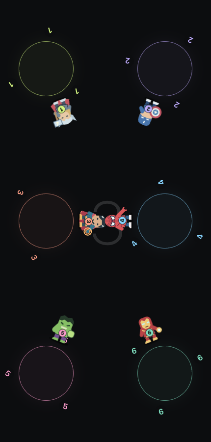
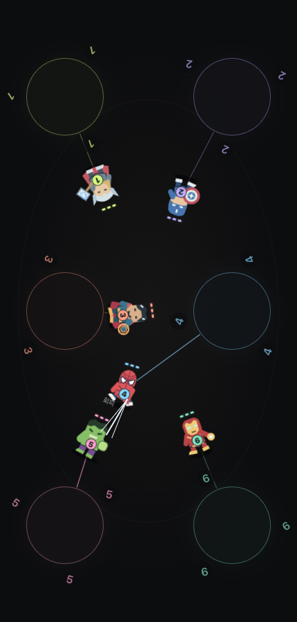
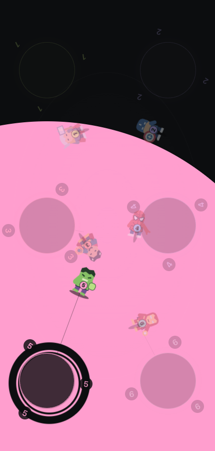
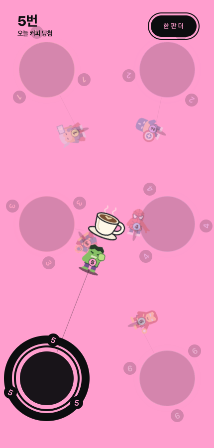
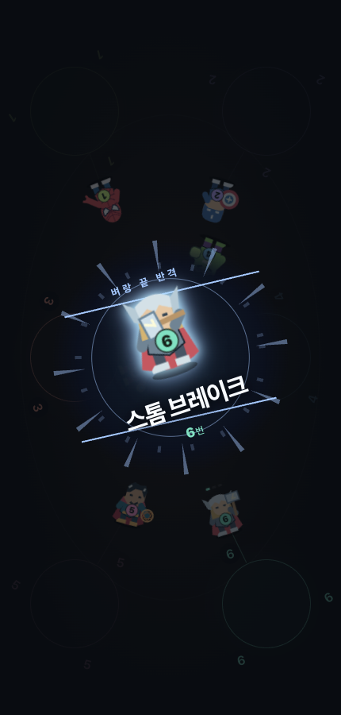
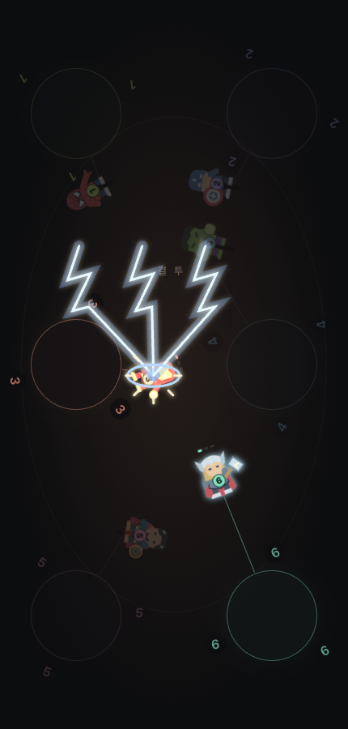

# 운빨망겜 · 커피 난투

점심시간, 오늘 커피는 누가 살까요? 한 화면에 손가락을 올리면 작은 히어로들이 자동으로 모여 싸웁니다. **끝까지 살아남은 한 명이 오늘의 커피 당첨자!**

**[웹에서 바로 플레이](https://git.readiz.com/RandomGame/)** · **[Android APK 다운로드](https://github.com/Readiz/RandomGame/releases/latest/download/random-game.apk)** · [최신 릴리스](https://github.com/Readiz/RandomGame/releases/latest)

2~10명이 한 기기로 함께하는 짧은 커피내기 게임입니다. 메뉴 없이 손가락을 올리는 것만으로 시작합니다.

## 실제 플레이 화면

<table>
  <tr>
    <th>1. 손가락으로 참여</th>
    <th>2. 히어로들의 자동 난투</th>
  </tr>
  <tr>
    <td align="center"></td>
    <td align="center"></td>
  </tr>
  <tr>
    <th>3. 당첨자 색이 확 퍼지고</th>
    <th>4. 마지막 생존자가 커피 당첨</th>
  </tr>
  <tr>
    <td align="center"></td>
    <td align="center"></td>
  </tr>
  <tr>
    <th>5. 벼랑 끝 필살기 컷씬</th>
    <th>6. 히어로마다 다른 대형 공격</th>
  </tr>
  <tr>
    <td align="center"></td>
    <td align="center"></td>
  </tr>
</table>

실제 게임 화면입니다. 결과 화면은 v2.2.9, 나머지는 v2.2.8에서 촬영했습니다. 색이 퍼지는 동안에도 캐릭터와 번호는 계속 보입니다.

## 플레이 방법

1. 함께할 사람들이 화면에 손가락을 하나씩 올립니다.
2. **2명 이상이 3초간 유지하면 자동 시작합니다.** 싸움이 시작된 뒤에는 손을 떼도 됩니다.
3. 마지막까지 살아남은 캐릭터의 주인이 커피를 삽니다. **한 판 더**를 누르면 바로 다시 시작합니다.

PC에서는 클릭으로 참여하고 같은 자리를 다시 클릭하면 취소됩니다. 키보드는 참여 공간에서 Enter/Space로 추가, Escape로 초기화할 수 있습니다. 최대 10명이며 실제 동시 터치 수는 기기에 따라 다릅니다.

## 이런 재미가 있어요

- **내 캐릭터를 한눈에:** 손가락 둘레를 도는 번호 3개와 캐릭터 몸통 번호가 같습니다. 캐릭터와 숫자는 화면 중앙을 향하고, 이동 중에는 연결선이 자기 자리를 알려줍니다.
- **다르게 싸우는 히어로 6종:** 빔을 쏘는 파워슈트, 방패 전사, 번개 전사, 초록 거인, 거미 곡예사, 마법사. 첫 6명까지는 중복 없이 배정하며, 공격 연출은 달라도 체력·피해·회피·치명타 확률과 승률은 같습니다.
- **여러 공격이 겹치는 난투:** 캐릭터가 자기 손가락 자리 앞에 모여 움직이고, 빔·투척·돌진·마법을 동시에 주고받습니다. 둘만 남으면 서로 세 번씩 공격을 막고 반격한 뒤 마지막 결투를 이어갑니다. 추가 공방은 체력과 당첨 확률을 바꾸지 않습니다.
- **벼랑 끝 필살기:** 일반 공격은 두 가지 동작을 번갈아 사용합니다. 체력 1의 반격과 마지막 일격에는 0.82초의 캐릭터 컷씬, 기술명, 전용 공격 연출이 이어집니다. 실제로 열세를 뒤집는 타격은 ‘역전의 한방’으로 강조합니다. 컷씬은 한 판에 최대 두 번이며 전투 판정·피해·승률을 바꾸지 않습니다.
- **놓칠 수 없는 결과:** 당첨자 손가락 자리에서 그 사람의 색이 약 0.6초 동안 확 퍼지고, 검은 이중 링과 강한 3연속 진동으로 결과를 알립니다. 생존자는 중앙으로 걸어와 새로 나타난 커피잔 위에서 승리 동작을 합니다. 손가락 표시·회전 번호·연결선과 쓰러진 캐릭터도 남습니다.

## Android로 설치하기

[최신 APK](https://github.com/Readiz/RandomGame/releases/latest/download/random-game.apk)를 받아 설치하세요. Android 6.0 이상 휴대전화·태블릿에서 실행할 수 있고, 설치 후에는 **인터넷 없이도 플레이**할 수 있습니다. 기존 버전이 있다면 새 APK를 덮어 설치하면 됩니다.

**v2.2.7부터 자동 업데이트 확인을 지원합니다.** 앱 실행·복귀 때 새 버전을 확인하고, 빈 대기 화면에서 안내합니다. ‘업데이트’를 누르면 APK를 받아 Android 설치 화면으로 이어집니다. 게임 중에는 안내를 미룹니다. v2.2.6 이하를 쓰고 있다면 이번 APK만 한 번 직접 설치해 주세요.

브라우저에서도 같은 게임을 바로 즐길 수 있습니다. 실제 동시 터치 수와 진동 지원·체감 강도는 기기와 설정에 따라 다릅니다. 모션 줄이기 설정에서는 색 확산·공전 애니메이션과 진동을 끕니다.

[앱 빌드·설치 안내](android/README.md)에서 패키지와 서명·검증 방법을 확인할 수 있습니다.

## 히어로 필살기

| 히어로 | 필살기 | 공격 연출 |
| --- | --- | --- |
| 파워슈트 | 아크 버스터 | 부양 후 교차 빔과 대형 광선 |
| 방패 전사 | 코멧 실드 | 연속 방패 잔상과 별 모양 충격파 |
| 번개 전사 | 스톰 브레이크 | 망치 투척과 세 갈래 낙뢰 |
| 초록 거인 | 메테오 스매시 | 도약 강타, 지면 균열과 파편 |
| 거미 곡예사 | 웹 피니시 | 곡선 급습과 거미줄 포박 |
| 마법사 | 차원 붕괴 | 여섯 마법진에서 모이는 차원 공격 |

컷씬의 번호·색은 손가락 표시와 일치하고, 해당 참가자가 바라보는 방향으로 회전합니다. 컷씬 동안 전투는 멈추며 앱을 잠시 벗어나면 컷씬도 함께 멈춥니다. 모션 줄이기 설정에서는 정적인 컷씬을 사용하고 도약·회전·진동을 줄입니다.

<details>
<summary>상세 게임 규칙과 기기 동작</summary>

- 손가락마다 같은 색과 번호의 작은 기사가 등장합니다. 2명 이상 3초 동안 유지하면 자동 시작합니다.
- 기사는 손가락 자리보다 중앙 방향으로 96px 앞에 생성되어 화면 중앙을 향해 회전합니다. 손가락 원은 지름 112px이며 테두리보다 22px 바깥에서 120도 간격으로 공전하는 번호 3개와 몸통 번호가 같아 어느 쪽에 앉아도 자기 기사를 구분할 수 있습니다. 가장자리에서는 표시가 잘리지 않게 조금 안쪽으로 배치합니다.
- 이동·전투 중에는 참가자 색의 가는 선이 손가락 자리와 기사를 연결합니다. 손을 움직이면 선이 따라오고, 손을 떼면 마지막 자리를 유지합니다. 탈락자의 선은 흐려집니다.
- 캐릭터와 테두리를 도는 숫자는 각각 현재 위치에서 화면 정중앙을 향합니다. 숫자는 손가락 주위를 공전해도 공전 각도에 맞춰 뒤집히지 않습니다.
- 마블 영웅의 실루엣을 참고한 파워슈트·방패 전사·번개 전사·초록 거인·거미 곡예사·마법사 6종이 있습니다. 첫 6명까지는 중복 없이 무작위 배정합니다. 손바닥 충전·빔 발사, 방패 투척·회수, 망치 준비·번개 낙하, 주먹 내려찍기·지면 충격파, 거미줄 발사·그물, 회전 마법진의 준비·발사·명중 동작과 공격 거리만 다르며 체력·피해·회피·치명타 확률과 승률은 동일합니다.
- 원래 손가락 자리에서 중앙까지 거리의 약 42%만 안쪽으로 이동해 넓게 집결합니다. 손가락에 가려지지 않도록 가까운 자리는 최소 120px 이동하고(중앙까지 남은 거리 이내), 겹치는 캐릭터는 조금 벌립니다. 집결 전에는 공격하거나 체력이 줄지 않습니다.
- 여러 캐릭터가 주변을 오가며 공격을 겹쳐 펼칩니다. 원거리 캐릭터는 자기 자리 부근에서 쏘고, 거인은 더 길게 돌진합니다. 공격·회피·치명타·밀려남·쓰러짐을 거쳐 마지막까지 살아남은 한 명이 커피 당첨자입니다.
- 둘만 남으면 각자 세 번씩 공격하고 막는 6합을 약 3초간 추가한 뒤 결투를 이어갑니다. 이 공방은 체력·전투 턴·난수를 건드리지 않아 같은 난수에서 승자와 탈락 순서가 같습니다. 당첨 순간 손가락 표시 자리에서 당첨자 색이 원형으로 빠르게 퍼져 0.62초 만에 화면 전체를 채우고, 표시 바깥에는 검은 이중 링이 나타납니다. 중앙에는 커피잔이 생기고 최후의 생존자가 잔 위로 올라와 승리 동작을 합니다. 커피잔 가장자리에 발을 맞추고, 잔과 캐릭터를 참가자가 앉은 방향에 맞춰 함께 회전시킵니다. 캐릭터·공전 번호·손가락 표시·연결선과 쓰러진 캐릭터는 계속 남습니다. 결과와 재시작은 링 반대편에 표시합니다.
- 체력은 모두 3입니다. 공격자는 생존자 중, 상대는 다른 생존자 중 같은 확률로 뽑습니다. 손가락의 위치·이동 거리·화면 크기는 전투 결과에 영향을 주지 않습니다. 공격 연출이 겹쳐도 타격 결과는 원래 무작위 순서를 지키며, 같은 난수에서는 기존 순차 전투와 승자·피해·탈락 순서가 같습니다.
- 처음 3번의 공격에는 치명타가 없습니다. 회피가 연속해서 나오지 않도록 해 게임이 반드시 끝나게 합니다. 한 명만 남으면 결과가 고정됩니다.
- 필살기는 이미 정해진 명중 결과에 붙는 연출입니다. 체력 1의 결투 반격을 우선 선택하고 마지막 타격도 강조하되, 같은 참가자의 중복 컷씬은 피하고 한 판에 최대 두 번만 보여줍니다. 추가 피해나 체력 회복, 새로운 난수 추첨은 없습니다. 일반 공격을 비롯한 모든 타격은 화면 효과의 개수와 관계없이 한 번만 판정합니다.
- 화면에는 최대 10명 참여 안내, 손가락 표시와 캐릭터, 전투에 필요한 체력, 결과와 재시작만 남깁니다. 메뉴·연습·설명창·통계·장식 헤더·하단 링크는 표시하지 않습니다.
- 시작 전 손을 떼면 참여가 취소됩니다. 시작 후에는 손을 떼도 참가자는 유지됩니다. 최대 10명이며 실제 동시 터치 수는 기기에 따라 다릅니다.
- PC는 클릭으로 참가자를 추가하고 같은 위치를 다시 클릭해 취소합니다. 키보드는 참여 공간에 초점을 맞추고 Enter/Space로 추가, Escape로 초기화합니다.
- 다른 탭으로 가면 참가 대기는 취소됩니다. 진행 중인 이동·전투는 숨겨진 동안 멈췄다가 남은 단계부터 이어집니다.
- 지원하는 기기·브라우저에서는 참여·카운트다운·출발·일반 타격·치명타·탈락·결과에 서로 다른 진동을 줍니다. 진동을 지원하지 않거나 거부해도 게임은 진행됩니다. 브라우저의 사용자 상호작용 조건과 기기 설정에 따라 진동이 제한될 수 있습니다.
- 당첨 진동은 180·200·200ms의 긴 3연속 진동입니다(사이 간격 70ms, 전체 720ms). Android 앱은 이때 최대 진폭을 요청하며, 웹에서는 같은 길이의 패턴을 사용합니다. 실제 세기는 기기와 진동 설정에 따라 다릅니다.
- 모션 줄이기 설정에서는 번호 공전·장식 애니메이션·진동을 끕니다. 화면을 숨기거나 게임을 초기화하면 진행 중인 진동도 취소합니다.


</details>

## 개발

Node.js 22.12 이상, npm을 사용합니다.

```sh
npm ci
npm run dev
npm test
npm run build
npm run preview
```

기존 Node Sass/Rollup 구성을 Vite와 Svelte 5로 바꿨습니다. 클래식은 원래 컴포넌트를 별도 진입점에서 빌드합니다. 클래식 컴포넌트의 기존 접근성 경고는 커피내기 진입점과 별개입니다.

## 배포

현재 GitHub Pages는 `master` 브랜치의 `/docs`를 공개합니다.

```sh
npm run release:pages
```

이 명령은 테스트·빌드 후 필요한 정적 파일을 `docs`에 복사합니다. 자산을 먼저 복사하고 HTML을 마지막에 교체합니다. 검증한 소스와 `docs` 변경만 커밋해 `master`로 푸시하면 Pages가 배포합니다. 로컬 `output` 검증 자료와 의존성 폴더는 커밋하지 않습니다.


## 원래의 강화 게임

기존 운빨망겜은 [클래식 버전](https://git.readiz.com/RandomGame/classic.html)에서 계속 플레이할 수 있습니다. 커피 난투와 별도 진입점으로 유지합니다.

클래식 게임의 검 이미지는 기존 운빨망겜 자산을 재사용합니다. 원본 출처: https://www.gdunlimited.net/resources/cat/rpg-maker-xp/icons/2/comments/desc/96
